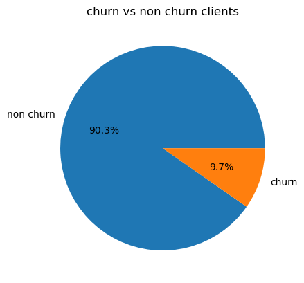

# My Exploratory Data Analysis 


## steps
*step1: Import libraries <br />
*step2: Read datasets into python <br />
*step3: Descriptive Statistics <br />
*step4: Data Visualization <br />


```python
#import libraries

import pandas as pd
import matplotlib.pyplot as plt
import seaborn as sns
```


```python
# Read data into Jupyter notebook

price_df =pd.read_csv(r"C:\Users\PC\Desktop\BGC Gamma\price_data.csv")
client_df = pd.read_csv(r"C:\Users\PC\Desktop\BGC Gamma\client_data.csv")
pd.set_option('display.max_columns', 26)
```


```python
#merge datasets

dfs_merge = pd.merge(price_df, client_df, on = 'id')
```


```python
dfs_merge.head()
```


<div>
<style scoped>
    .dataframe tbody tr th:only-of-type {
        vertical-align: middle;
    }

    .dataframe tbody tr th {
        vertical-align: top;
    }

    .dataframe thead th {
        text-align: right;
    }
</style>
<table border="1" class="dataframe">
  <thead>
    <tr style="text-align: right;">
      <th></th>
      <th>id</th>
      <th>price_date</th>
      <th>price_off_peak_var</th>
      <th>price_peak_var</th>
      <th>price_mid_peak_var</th>
      <th>price_off_peak_fix</th>
      <th>price_peak_fix</th>
      <th>price_mid_peak_fix</th>
      <th>channel_sales</th>
      <th>cons_12m</th>
      <th>cons_gas_12m</th>
      <th>cons_last_month</th>
      <th>date_activ</th>
      <th>...</th>
      <th>forecast_price_energy_off_peak</th>
      <th>forecast_price_energy_peak</th>
      <th>forecast_price_pow_off_peak</th>
      <th>has_gas</th>
      <th>imp_cons</th>
      <th>margin_gross_pow_ele</th>
      <th>margin_net_pow_ele</th>
      <th>nb_prod_act</th>
      <th>net_margin</th>
      <th>num_years_antig</th>
      <th>origin_up</th>
      <th>pow_max</th>
      <th>churn</th>
    </tr>
  </thead>
  <tbody>
    <tr>
      <th>0</th>
      <td>038af19179925da21a25619c5a24b745</td>
      <td>2015-01-01</td>
      <td>0.151367</td>
      <td>0.0</td>
      <td>0.0</td>
      <td>44.266931</td>
      <td>0.0</td>
      <td>0.0</td>
      <td>foosdfpfkusacimwkcsosbicdxkicaua</td>
      <td>3576</td>
      <td>0</td>
      <td>630</td>
      <td>2013-06-03</td>
      <td>...</td>
      <td>0.14398</td>
      <td>0.0</td>
      <td>44.311378</td>
      <td>f</td>
      <td>91.82</td>
      <td>21.52</td>
      <td>21.52</td>
      <td>1</td>
      <td>52.53</td>
      <td>3</td>
      <td>ldkssxwpmemidmecebumciepifcamkci</td>
      <td>13.2</td>
      <td>0</td>
    </tr>
    <tr>
      <th>1</th>
      <td>038af19179925da21a25619c5a24b745</td>
      <td>2015-02-01</td>
      <td>0.151367</td>
      <td>0.0</td>
      <td>0.0</td>
      <td>44.266931</td>
      <td>0.0</td>
      <td>0.0</td>
      <td>foosdfpfkusacimwkcsosbicdxkicaua</td>
      <td>3576</td>
      <td>0</td>
      <td>630</td>
      <td>2013-06-03</td>
      <td>...</td>
      <td>0.14398</td>
      <td>0.0</td>
      <td>44.311378</td>
      <td>f</td>
      <td>91.82</td>
      <td>21.52</td>
      <td>21.52</td>
      <td>1</td>
      <td>52.53</td>
      <td>3</td>
      <td>ldkssxwpmemidmecebumciepifcamkci</td>
      <td>13.2</td>
      <td>0</td>
    </tr>
    <tr>
      <th>2</th>
      <td>038af19179925da21a25619c5a24b745</td>
      <td>2015-03-01</td>
      <td>0.151367</td>
      <td>0.0</td>
      <td>0.0</td>
      <td>44.266931</td>
      <td>0.0</td>
      <td>0.0</td>
      <td>foosdfpfkusacimwkcsosbicdxkicaua</td>
      <td>3576</td>
      <td>0</td>
      <td>630</td>
      <td>2013-06-03</td>
      <td>...</td>
      <td>0.14398</td>
      <td>0.0</td>
      <td>44.311378</td>
      <td>f</td>
      <td>91.82</td>
      <td>21.52</td>
      <td>21.52</td>
      <td>1</td>
      <td>52.53</td>
      <td>3</td>
      <td>ldkssxwpmemidmecebumciepifcamkci</td>
      <td>13.2</td>
      <td>0</td>
    </tr>
    <tr>
      <th>3</th>
      <td>038af19179925da21a25619c5a24b745</td>
      <td>2015-04-01</td>
      <td>0.149626</td>
      <td>0.0</td>
      <td>0.0</td>
      <td>44.266931</td>
      <td>0.0</td>
      <td>0.0</td>
      <td>foosdfpfkusacimwkcsosbicdxkicaua</td>
      <td>3576</td>
      <td>0</td>
      <td>630</td>
      <td>2013-06-03</td>
      <td>...</td>
      <td>0.14398</td>
      <td>0.0</td>
      <td>44.311378</td>
      <td>f</td>
      <td>91.82</td>
      <td>21.52</td>
      <td>21.52</td>
      <td>1</td>
      <td>52.53</td>
      <td>3</td>
      <td>ldkssxwpmemidmecebumciepifcamkci</td>
      <td>13.2</td>
      <td>0</td>
    </tr>
    <tr>
      <th>4</th>
      <td>038af19179925da21a25619c5a24b745</td>
      <td>2015-05-01</td>
      <td>0.149626</td>
      <td>0.0</td>
      <td>0.0</td>
      <td>44.266931</td>
      <td>0.0</td>
      <td>0.0</td>
      <td>foosdfpfkusacimwkcsosbicdxkicaua</td>
      <td>3576</td>
      <td>0</td>
      <td>630</td>
      <td>2013-06-03</td>
      <td>...</td>
      <td>0.14398</td>
      <td>0.0</td>
      <td>44.311378</td>
      <td>f</td>
      <td>91.82</td>
      <td>21.52</td>
      <td>21.52</td>
      <td>1</td>
      <td>52.53</td>
      <td>3</td>
      <td>ldkssxwpmemidmecebumciepifcamkci</td>
      <td>13.2</td>
      <td>0</td>
    </tr>
  </tbody>
</table>
<p>5 rows × 33 columns</p>
</div>


```python
dfs_merge.describe()
```


<div>
<style scoped>
    .dataframe tbody tr th:only-of-type {
        vertical-align: middle;
    }

    .dataframe tbody tr th {
        vertical-align: top;
    }

    .dataframe thead th {
        text-align: right;
    }
</style>
<table border="1" class="dataframe">
  <thead>
    <tr style="text-align: right;">
      <th></th>
      <th>price_off_peak_var</th>
      <th>price_peak_var</th>
      <th>price_mid_peak_var</th>
      <th>price_off_peak_fix</th>
      <th>price_peak_fix</th>
      <th>price_mid_peak_fix</th>
      <th>cons_12m</th>
      <th>cons_gas_12m</th>
      <th>cons_last_month</th>
      <th>forecast_cons_12m</th>
      <th>forecast_cons_year</th>
      <th>forecast_discount_energy</th>
      <th>forecast_meter_rent_12m</th>
      <th>forecast_price_energy_off_peak</th>
      <th>forecast_price_energy_peak</th>
      <th>forecast_price_pow_off_peak</th>
      <th>imp_cons</th>
      <th>margin_gross_pow_ele</th>
      <th>margin_net_pow_ele</th>
      <th>nb_prod_act</th>
      <th>net_margin</th>
      <th>num_years_antig</th>
      <th>pow_max</th>
      <th>churn</th>
    </tr>
  </thead>
  <tbody>
    <tr>
      <th>count</th>
      <td>175149.000000</td>
      <td>175149.000000</td>
      <td>175149.000000</td>
      <td>175149.000000</td>
      <td>175149.000000</td>
      <td>175149.000000</td>
      <td>1.751490e+05</td>
      <td>1.751490e+05</td>
      <td>175149.000000</td>
      <td>175149.000000</td>
      <td>175149.000000</td>
      <td>175149.000000</td>
      <td>175149.000000</td>
      <td>175149.000000</td>
      <td>175149.000000</td>
      <td>175149.000000</td>
      <td>175149.000000</td>
      <td>175149.000000</td>
      <td>175149.000000</td>
      <td>175149.00000</td>
      <td>175149.000000</td>
      <td>175149.000000</td>
      <td>175149.000000</td>
      <td>175149.000000</td>
    </tr>
    <tr>
      <th>mean</th>
      <td>0.142331</td>
      <td>0.052059</td>
      <td>0.028270</td>
      <td>42.929009</td>
      <td>9.458953</td>
      <td>6.096434</td>
      <td>1.592606e+05</td>
      <td>2.808072e+04</td>
      <td>16095.518404</td>
      <td>1868.343884</td>
      <td>1399.782380</td>
      <td>0.967028</td>
      <td>63.074649</td>
      <td>0.137287</td>
      <td>0.050487</td>
      <td>43.130229</td>
      <td>152.789831</td>
      <td>24.566829</td>
      <td>24.564223</td>
      <td>1.29230</td>
      <td>189.245305</td>
      <td>4.998276</td>
      <td>18.134896</td>
      <td>0.097077</td>
    </tr>
    <tr>
      <th>std</th>
      <td>0.023340</td>
      <td>0.050286</td>
      <td>0.036065</td>
      <td>4.620531</td>
      <td>12.133202</td>
      <td>7.822250</td>
      <td>5.735413e+05</td>
      <td>1.629400e+05</td>
      <td>64376.741908</td>
      <td>2387.560169</td>
      <td>3248.331276</td>
      <td>5.109025</td>
      <td>66.143996</td>
      <td>0.024625</td>
      <td>0.049036</td>
      <td>4.486779</td>
      <td>341.426992</td>
      <td>20.234481</td>
      <td>20.233588</td>
      <td>0.70978</td>
      <td>311.846765</td>
      <td>1.611801</td>
      <td>13.535809</td>
      <td>0.296064</td>
    </tr>
    <tr>
      <th>min</th>
      <td>0.000000</td>
      <td>0.000000</td>
      <td>0.000000</td>
      <td>0.000000</td>
      <td>0.000000</td>
      <td>0.000000</td>
      <td>0.000000e+00</td>
      <td>0.000000e+00</td>
      <td>0.000000</td>
      <td>0.000000</td>
      <td>0.000000</td>
      <td>0.000000</td>
      <td>0.000000</td>
      <td>0.000000</td>
      <td>0.000000</td>
      <td>0.000000</td>
      <td>0.000000</td>
      <td>0.000000</td>
      <td>0.000000</td>
      <td>1.00000</td>
      <td>0.000000</td>
      <td>1.000000</td>
      <td>3.300000</td>
      <td>0.000000</td>
    </tr>
    <tr>
      <th>25%</th>
      <td>0.126595</td>
      <td>0.000000</td>
      <td>0.000000</td>
      <td>40.728885</td>
      <td>0.000000</td>
      <td>0.000000</td>
      <td>5.674000e+03</td>
      <td>0.000000e+00</td>
      <td>0.000000</td>
      <td>494.980000</td>
      <td>0.000000</td>
      <td>0.000000</td>
      <td>16.180000</td>
      <td>0.116340</td>
      <td>0.000000</td>
      <td>40.606701</td>
      <td>0.000000</td>
      <td>14.280000</td>
      <td>14.280000</td>
      <td>1.00000</td>
      <td>50.710000</td>
      <td>4.000000</td>
      <td>12.500000</td>
      <td>0.000000</td>
    </tr>
    <tr>
      <th>50%</th>
      <td>0.146788</td>
      <td>0.084213</td>
      <td>0.000000</td>
      <td>44.266930</td>
      <td>0.000000</td>
      <td>0.000000</td>
      <td>1.411500e+04</td>
      <td>0.000000e+00</td>
      <td>792.000000</td>
      <td>1112.610000</td>
      <td>314.000000</td>
      <td>0.000000</td>
      <td>18.790000</td>
      <td>0.143166</td>
      <td>0.084138</td>
      <td>44.311378</td>
      <td>37.390000</td>
      <td>21.640000</td>
      <td>21.640000</td>
      <td>1.00000</td>
      <td>112.500000</td>
      <td>5.000000</td>
      <td>13.856000</td>
      <td>0.000000</td>
    </tr>
    <tr>
      <th>75%</th>
      <td>0.151635</td>
      <td>0.102114</td>
      <td>0.072900</td>
      <td>44.444710</td>
      <td>24.339581</td>
      <td>16.226389</td>
      <td>4.076300e+04</td>
      <td>0.000000e+00</td>
      <td>3383.000000</td>
      <td>2400.350000</td>
      <td>1745.000000</td>
      <td>0.000000</td>
      <td>131.030000</td>
      <td>0.146348</td>
      <td>0.098837</td>
      <td>44.311378</td>
      <td>193.990000</td>
      <td>29.880000</td>
      <td>29.880000</td>
      <td>1.00000</td>
      <td>243.000000</td>
      <td>6.000000</td>
      <td>19.180000</td>
      <td>0.000000</td>
    </tr>
    <tr>
      <th>max</th>
      <td>0.280700</td>
      <td>0.229788</td>
      <td>0.114102</td>
      <td>59.444710</td>
      <td>36.490689</td>
      <td>17.458221</td>
      <td>6.207104e+06</td>
      <td>4.154590e+06</td>
      <td>771203.000000</td>
      <td>82902.830000</td>
      <td>175375.000000</td>
      <td>30.000000</td>
      <td>599.310000</td>
      <td>0.273963</td>
      <td>0.195975</td>
      <td>59.266378</td>
      <td>15042.790000</td>
      <td>374.640000</td>
      <td>374.640000</td>
      <td>32.00000</td>
      <td>24570.650000</td>
      <td>13.000000</td>
      <td>320.000000</td>
      <td>1.000000</td>
    </tr>
  </tbody>
</table>
</div>


# Descriptive statistics


```python
# Distinct count of churn column

client_count = client_df['churn'].value_counts(normalize = True).mul(100).round(1)

```


```python
# add labels 
labels = ['non churn','churn']

# plot pie chart of client_count, add labels and label values

plt.pie(client_count, labels = labels, autopct = '%.1f%%')

# set title
plt.title('churn vs non churn clients')

# show chart

plt.show()
```


    

    


```python
# filter churn and non churn

churn_clients = dfs_merge[dfs_merge['churn'] == 1]

non_churn = dfs_merge[dfs_merge['churn'] == 0]
```


```python
# find avgerage price for price_off_peak_var, grouppedby price_date for churn and non churn

churned_avg_price = churn_clients.groupby('price_date')['price_off_peak_var'].mean()
non_churned_avg_price = non_churn.groupby('price_date')['price_off_peak_var'].mean()

# print results

print(churned_avg_price)
print(non_churned_avg_price)
```

    price_date
    2015-01-01    0.143417
    2015-02-01    0.143662
    2015-03-01    0.143756
    2015-04-01    0.144158
    2015-05-01    0.144689
    2015-06-01    0.145024
    2015-07-01    0.144834
    2015-08-01    0.138646
    2015-09-01    0.138854
    2015-10-01    0.138384
    2015-11-01    0.138556
    2015-12-01    0.138810
    Name: price_off_peak_var, dtype: float64
    price_date
    2015-01-01    0.144004
    2015-02-01    0.144204
    2015-03-01    0.144420
    2015-04-01    0.144519
    2015-05-01    0.144756
    2015-06-01    0.144936
    2015-07-01    0.144959
    2015-08-01    0.139324
    2015-09-01    0.139327
    2015-10-01    0.139316
    2015-11-01    0.139335
    2015-12-01    0.139433
    Name: price_off_peak_var, dtype: float64
    


```python
# plot x and y bar values for churn and retained
plt.bar(non_churned_avg_price.index, non_churned_avg_price.values, label = 'Non churned')
plt.bar(churned_avg_price.index, churned_avg_price.values, label = 'Churn')

# set tittle, Y and X labels
plt.xlabel('Period')
plt.ylabel('Avg prices')
plt.title('Avg prices by period for churn and non churn clients')

# set legend on the lower right 
plt.legend(loc = 'lower right')

# Rotate x axis labels to 60 degrees
plt.xticks(rotation = 60)

# show the plot
plt.show()

```


    

    


From the above plot, price sensitivity is not a factor in churn for this particular dataset, as the prices are consistent for both groups.


```python
# find the correlation between churn and differnt price periods for energy

correlation_matrix = dfs_merge[['churn', 'price_off_peak_var', 'price_peak_var','price_mid_peak_var']].corr()

#print result

print(correlation_matrix)
```

                           churn  price_off_peak_var  price_peak_var  \
    churn               1.000000           -0.006075        0.029314   
    price_off_peak_var -0.006075            1.000000       -0.297574   
    price_peak_var      0.029314           -0.297574        1.000000   
    price_mid_peak_var  0.046120           -0.585341        0.815970   
    
                        price_mid_peak_var  
    churn                         0.046120  
    price_off_peak_var           -0.585341  
    price_peak_var                0.815970  
    price_mid_peak_var            1.000000  
    


```python
# find the correlation btween churn and different price periods for power

cor_matrix_pow = dfs_merge[['churn', 'price_off_peak_fix', 'price_peak_fix', 'price_mid_peak_fix']].corr()

print result
print(cor_matrix_pow)
```


      Cell In[13], line 5
        print result
        ^
    SyntaxError: Missing parentheses in call to 'print'. Did you mean print(...)?
    


### conclusion

Based on this correlation matrix, price sensitivity for both Electricity and gas does not appear to be a significant factor in client churn. The variability in off-peak, peak, and mid-peak prices does not seem to significantly influence whether a client churns or not.

# Churn by Channel Sales


```python
channel = dfs_merge[['channel_sales', 'churn', 'id']]

# Group the data by 'channel_sales' and 'churn', and count the number of 'id' for each group

channel_group = channel.groupby(['channel_sales', 'churn'])['id'].count().unstack(level=1).fillna(0)

# Calculate the percentage of churn and non-churn for each sales channel

channel_percentage = (channel_group.div(channel_group.sum(axis = 1), axis = 0) * 100).sort_values(by = [1], ascending = False)

ax = channel_percentage.plot(kind = 'bar', stacked = True, figsize = (10,6))
ax.set_xlabel('sales channel')
ax.set_ylabel('percentage')
ax.set_title('churn and non-churn by sales channel')
plt.xticks(rotation = 60)

# Add percentage labels to the bars

for container in ax.containers:
    ax.bar_label(container, label_type = 'edge', fontsize = 8)
plt.tight_layout()
plt.show()
```


    

    


# An overview:
#### I will represent the channel sales code with alphabet following their order on the graph from left to right

#### channels: F *(epumfxlbckeskwekxbiuasklxalciiuu), G (fixdbufsefwooaasfcxdxadsiekoceaa) and H (sddiedcslfslkckwlfkdpoeeailfpeds)* have the highest retention rates with 100% of members retained. This suggests that these channels are very effective at keeping their members.

#### channel: E *(lmkebamcaaclubfxadlmueccxoimlema)* also has a high retention rate at 94.5%, indicating that it is also quite effective, though not as much as channels F, G, and H.

#### channel: D *(MISSING)*  despite missing channel name, has a retention rate of 92.5%. This is still a high retention rate, suggesting that this channel is also effective at retaining members.


  

#### channel:  A *(foosdfpfkusacimwkcsosbicdxkicaua), B (usilxuppasemubllopkaafesmlibmsdf), and C (ewpakwlliwisiwduibdlfmalxowmwpci)* have lower retention rates (87.9%, 90%, and 91.7% respectively) compared to the other channels. This could suggest that these channels may need to improve their strategies to retain more members.

#### Overall, all channels have a retention rate of over 85%, which is generally considered good. However, there is room for improvement, especially for channels :A ,B  and C


```python
channels = dfs_merge[['channel_sales','id']].groupby('channel_sales')['id'].count()

#crate the bar plot
ax = channels.plot(kind = 'bar', color ='skyblue', edgecolor = 'black')

# set title and labels with increased fontize.

ax.set_title('count of companies per sales channel', fontsize = 14)
ax.set_ylabel('company counts', fontsize = 12)
ax.set_xlabel('sales channels', fontsize = 12)

# Rotate the x axis label

plt.xticks(rotation = 80, fontsize = 10)

# Add labels on top of the bars

for i in ax.containers:
    ax.bar_label(i, fontsize = 10)

# Add a grid for better readability

ax.grid(True)

# show the plot
plt.show()
```


    

    


Channel A has the highest count of customers but 13% churned. It is fair to say that its a good sales channel with appropraite checks to reason for customer's churn.

It is important to identify the name of the missing Channel (D) because it is the 2nd biggest sales channel and well patronized although 8% of its users are churned.

channel F, G, and H seem to have good retaintion strategy but bad publicity because all its users are retained but have significantly low count of users.


```python
# create a csv file for churned members

churned_members = dfs_merge[dfs_merge['churn'] == 1]
churned_members.to_csv('churned_members.csv', index = False)
churned_members.head()

```


<div>
<style scoped>
    .dataframe tbody tr th:only-of-type {
        vertical-align: middle;
    }

    .dataframe tbody tr th {
        vertical-align: top;
    }

    .dataframe thead th {
        text-align: right;
    }
</style>
<table border="1" class="dataframe">
  <thead>
    <tr style="text-align: right;">
      <th></th>
      <th>price_off_peak_var</th>
      <th>price_peak_var</th>
      <th>price_mid_peak_var</th>
      <th>price_off_peak_fix</th>
      <th>price_peak_fix</th>
      <th>price_mid_peak_fix</th>
      <th>cons_12m</th>
      <th>cons_gas_12m</th>
      <th>cons_last_month</th>
      <th>forecast_cons_12m</th>
      <th>forecast_cons_year</th>
      <th>forecast_discount_energy</th>
      <th>forecast_meter_rent_12m</th>
      <th>forecast_price_energy_off_peak</th>
      <th>forecast_price_energy_peak</th>
      <th>forecast_price_pow_off_peak</th>
      <th>imp_cons</th>
      <th>margin_gross_pow_ele</th>
      <th>margin_net_pow_ele</th>
      <th>nb_prod_act</th>
      <th>net_margin</th>
      <th>num_years_antig</th>
      <th>pow_max</th>
      <th>churn</th>
    </tr>
  </thead>
  <tbody>
    <tr>
      <th>count</th>
      <td>17003.000000</td>
      <td>17003.000000</td>
      <td>17003.000000</td>
      <td>17003.000000</td>
      <td>17003.000000</td>
      <td>17003.000000</td>
      <td>1.700300e+04</td>
      <td>17003.000000</td>
      <td>17003.000000</td>
      <td>17003.000000</td>
      <td>17003.000000</td>
      <td>17003.000000</td>
      <td>17003.000000</td>
      <td>17003.000000</td>
      <td>17003.000000</td>
      <td>17003.000000</td>
      <td>17003.000000</td>
      <td>17003.000000</td>
      <td>17003.000000</td>
      <td>17003.000000</td>
      <td>17003.000000</td>
      <td>17003.000000</td>
      <td>17003.000000</td>
      <td>17003.0</td>
    </tr>
    <tr>
      <th>mean</th>
      <td>0.141898</td>
      <td>0.056554</td>
      <td>0.033343</td>
      <td>43.163536</td>
      <td>11.192617</td>
      <td>7.156747</td>
      <td>7.894305e+04</td>
      <td>9248.511792</td>
      <td>7213.902782</td>
      <td>1962.145197</td>
      <td>1374.616950</td>
      <td>1.233665</td>
      <td>72.002211</td>
      <td>0.136484</td>
      <td>0.054862</td>
      <td>43.333728</td>
      <td>151.173919</td>
      <td>30.477045</td>
      <td>30.477045</td>
      <td>1.260307</td>
      <td>228.312226</td>
      <td>4.634359</td>
      <td>19.390412</td>
      <td>1.0</td>
    </tr>
    <tr>
      <th>std</th>
      <td>0.022393</td>
      <td>0.050830</td>
      <td>0.037065</td>
      <td>3.339677</td>
      <td>12.505705</td>
      <td>8.001130</td>
      <td>2.605310e+05</td>
      <td>49704.646106</td>
      <td>26805.533462</td>
      <td>2756.394253</td>
      <td>2692.033316</td>
      <td>5.724504</td>
      <td>70.801353</td>
      <td>0.023835</td>
      <td>0.049621</td>
      <td>3.293460</td>
      <td>290.551419</td>
      <td>26.308288</td>
      <td>26.308288</td>
      <td>0.595728</td>
      <td>705.920395</td>
      <td>1.531879</td>
      <td>16.617392</td>
      <td>0.0</td>
    </tr>
    <tr>
      <th>min</th>
      <td>0.000000</td>
      <td>0.000000</td>
      <td>0.000000</td>
      <td>0.000000</td>
      <td>0.000000</td>
      <td>0.000000</td>
      <td>0.000000e+00</td>
      <td>0.000000</td>
      <td>0.000000</td>
      <td>0.000000</td>
      <td>0.000000</td>
      <td>0.000000</td>
      <td>0.000000</td>
      <td>0.092453</td>
      <td>0.000000</td>
      <td>40.606701</td>
      <td>0.000000</td>
      <td>0.000000</td>
      <td>0.000000</td>
      <td>1.000000</td>
      <td>0.000000</td>
      <td>2.000000</td>
      <td>6.000000</td>
      <td>1.0</td>
    </tr>
    <tr>
      <th>25%</th>
      <td>0.125976</td>
      <td>0.000000</td>
      <td>0.000000</td>
      <td>40.728885</td>
      <td>0.000000</td>
      <td>0.000000</td>
      <td>5.836000e+03</td>
      <td>0.000000</td>
      <td>0.000000</td>
      <td>503.050000</td>
      <td>0.000000</td>
      <td>0.000000</td>
      <td>16.270000</td>
      <td>0.115744</td>
      <td>0.000000</td>
      <td>40.606701</td>
      <td>0.000000</td>
      <td>17.130000</td>
      <td>17.130000</td>
      <td>1.000000</td>
      <td>52.130000</td>
      <td>4.000000</td>
      <td>13.150000</td>
      <td>1.0</td>
    </tr>
    <tr>
      <th>50%</th>
      <td>0.145101</td>
      <td>0.086905</td>
      <td>0.000000</td>
      <td>44.266930</td>
      <td>0.000000</td>
      <td>0.000000</td>
      <td>1.452900e+04</td>
      <td>0.000000</td>
      <td>740.000000</td>
      <td>1152.350000</td>
      <td>326.000000</td>
      <td>0.000000</td>
      <td>19.970000</td>
      <td>0.142819</td>
      <td>0.086803</td>
      <td>44.311378</td>
      <td>41.400000</td>
      <td>26.040000</td>
      <td>26.040000</td>
      <td>1.000000</td>
      <td>121.860000</td>
      <td>4.000000</td>
      <td>13.856000</td>
      <td>1.0</td>
    </tr>
    <tr>
      <th>75%</th>
      <td>0.151367</td>
      <td>0.103395</td>
      <td>0.073487</td>
      <td>44.266931</td>
      <td>24.339581</td>
      <td>16.226389</td>
      <td>4.086800e+04</td>
      <td>0.000000</td>
      <td>3095.000000</td>
      <td>2522.270000</td>
      <td>1688.500000</td>
      <td>0.000000</td>
      <td>131.840000</td>
      <td>0.145789</td>
      <td>0.099545</td>
      <td>44.311378</td>
      <td>187.755000</td>
      <td>34.680000</td>
      <td>34.680000</td>
      <td>1.000000</td>
      <td>271.900000</td>
      <td>6.000000</td>
      <td>19.800000</td>
      <td>1.0</td>
    </tr>
    <tr>
      <th>max</th>
      <td>0.280700</td>
      <td>0.169597</td>
      <td>0.101037</td>
      <td>59.444710</td>
      <td>36.490689</td>
      <td>16.958222</td>
      <td>3.955941e+06</td>
      <td>828344.000000</td>
      <td>448776.000000</td>
      <td>61357.170000</td>
      <td>37891.000000</td>
      <td>30.000000</td>
      <td>548.410000</td>
      <td>0.273963</td>
      <td>0.168092</td>
      <td>59.266378</td>
      <td>4205.640000</td>
      <td>299.640000</td>
      <td>299.640000</td>
      <td>5.000000</td>
      <td>24570.650000</td>
      <td>13.000000</td>
      <td>320.000000</td>
      <td>1.0</td>
    </tr>
  </tbody>
</table>
</div>


```python
churned_members.describe()
```


<div>
<style scoped>
    .dataframe tbody tr th:only-of-type {
        vertical-align: middle;
    }

    .dataframe tbody tr th {
        vertical-align: top;
    }

    .dataframe thead th {
        text-align: right;
    }
</style>
<table border="1" class="dataframe">
  <thead>
    <tr style="text-align: right;">
      <th></th>
      <th>price_off_peak_var</th>
      <th>price_peak_var</th>
      <th>price_mid_peak_var</th>
      <th>price_off_peak_fix</th>
      <th>price_peak_fix</th>
      <th>price_mid_peak_fix</th>
      <th>cons_12m</th>
      <th>cons_gas_12m</th>
      <th>cons_last_month</th>
      <th>forecast_cons_12m</th>
      <th>forecast_cons_year</th>
      <th>forecast_discount_energy</th>
      <th>forecast_meter_rent_12m</th>
      <th>forecast_price_energy_off_peak</th>
      <th>forecast_price_energy_peak</th>
      <th>forecast_price_pow_off_peak</th>
      <th>imp_cons</th>
      <th>margin_gross_pow_ele</th>
      <th>margin_net_pow_ele</th>
      <th>nb_prod_act</th>
      <th>net_margin</th>
      <th>num_years_antig</th>
      <th>pow_max</th>
      <th>churn</th>
    </tr>
  </thead>
  <tbody>
    <tr>
      <th>count</th>
      <td>17003.000000</td>
      <td>17003.000000</td>
      <td>17003.000000</td>
      <td>17003.000000</td>
      <td>17003.000000</td>
      <td>17003.000000</td>
      <td>1.700300e+04</td>
      <td>17003.000000</td>
      <td>17003.000000</td>
      <td>17003.000000</td>
      <td>17003.000000</td>
      <td>17003.000000</td>
      <td>17003.000000</td>
      <td>17003.000000</td>
      <td>17003.000000</td>
      <td>17003.000000</td>
      <td>17003.000000</td>
      <td>17003.000000</td>
      <td>17003.000000</td>
      <td>17003.000000</td>
      <td>17003.000000</td>
      <td>17003.000000</td>
      <td>17003.000000</td>
      <td>17003.0</td>
    </tr>
    <tr>
      <th>mean</th>
      <td>0.141898</td>
      <td>0.056554</td>
      <td>0.033343</td>
      <td>43.163536</td>
      <td>11.192617</td>
      <td>7.156747</td>
      <td>7.894305e+04</td>
      <td>9248.511792</td>
      <td>7213.902782</td>
      <td>1962.145197</td>
      <td>1374.616950</td>
      <td>1.233665</td>
      <td>72.002211</td>
      <td>0.136484</td>
      <td>0.054862</td>
      <td>43.333728</td>
      <td>151.173919</td>
      <td>30.477045</td>
      <td>30.477045</td>
      <td>1.260307</td>
      <td>228.312226</td>
      <td>4.634359</td>
      <td>19.390412</td>
      <td>1.0</td>
    </tr>
    <tr>
      <th>std</th>
      <td>0.022393</td>
      <td>0.050830</td>
      <td>0.037065</td>
      <td>3.339677</td>
      <td>12.505705</td>
      <td>8.001130</td>
      <td>2.605310e+05</td>
      <td>49704.646106</td>
      <td>26805.533462</td>
      <td>2756.394253</td>
      <td>2692.033316</td>
      <td>5.724504</td>
      <td>70.801353</td>
      <td>0.023835</td>
      <td>0.049621</td>
      <td>3.293460</td>
      <td>290.551419</td>
      <td>26.308288</td>
      <td>26.308288</td>
      <td>0.595728</td>
      <td>705.920395</td>
      <td>1.531879</td>
      <td>16.617392</td>
      <td>0.0</td>
    </tr>
    <tr>
      <th>min</th>
      <td>0.000000</td>
      <td>0.000000</td>
      <td>0.000000</td>
      <td>0.000000</td>
      <td>0.000000</td>
      <td>0.000000</td>
      <td>0.000000e+00</td>
      <td>0.000000</td>
      <td>0.000000</td>
      <td>0.000000</td>
      <td>0.000000</td>
      <td>0.000000</td>
      <td>0.000000</td>
      <td>0.092453</td>
      <td>0.000000</td>
      <td>40.606701</td>
      <td>0.000000</td>
      <td>0.000000</td>
      <td>0.000000</td>
      <td>1.000000</td>
      <td>0.000000</td>
      <td>2.000000</td>
      <td>6.000000</td>
      <td>1.0</td>
    </tr>
    <tr>
      <th>25%</th>
      <td>0.125976</td>
      <td>0.000000</td>
      <td>0.000000</td>
      <td>40.728885</td>
      <td>0.000000</td>
      <td>0.000000</td>
      <td>5.836000e+03</td>
      <td>0.000000</td>
      <td>0.000000</td>
      <td>503.050000</td>
      <td>0.000000</td>
      <td>0.000000</td>
      <td>16.270000</td>
      <td>0.115744</td>
      <td>0.000000</td>
      <td>40.606701</td>
      <td>0.000000</td>
      <td>17.130000</td>
      <td>17.130000</td>
      <td>1.000000</td>
      <td>52.130000</td>
      <td>4.000000</td>
      <td>13.150000</td>
      <td>1.0</td>
    </tr>
    <tr>
      <th>50%</th>
      <td>0.145101</td>
      <td>0.086905</td>
      <td>0.000000</td>
      <td>44.266930</td>
      <td>0.000000</td>
      <td>0.000000</td>
      <td>1.452900e+04</td>
      <td>0.000000</td>
      <td>740.000000</td>
      <td>1152.350000</td>
      <td>326.000000</td>
      <td>0.000000</td>
      <td>19.970000</td>
      <td>0.142819</td>
      <td>0.086803</td>
      <td>44.311378</td>
      <td>41.400000</td>
      <td>26.040000</td>
      <td>26.040000</td>
      <td>1.000000</td>
      <td>121.860000</td>
      <td>4.000000</td>
      <td>13.856000</td>
      <td>1.0</td>
    </tr>
    <tr>
      <th>75%</th>
      <td>0.151367</td>
      <td>0.103395</td>
      <td>0.073487</td>
      <td>44.266931</td>
      <td>24.339581</td>
      <td>16.226389</td>
      <td>4.086800e+04</td>
      <td>0.000000</td>
      <td>3095.000000</td>
      <td>2522.270000</td>
      <td>1688.500000</td>
      <td>0.000000</td>
      <td>131.840000</td>
      <td>0.145789</td>
      <td>0.099545</td>
      <td>44.311378</td>
      <td>187.755000</td>
      <td>34.680000</td>
      <td>34.680000</td>
      <td>1.000000</td>
      <td>271.900000</td>
      <td>6.000000</td>
      <td>19.800000</td>
      <td>1.0</td>
    </tr>
    <tr>
      <th>max</th>
      <td>0.280700</td>
      <td>0.169597</td>
      <td>0.101037</td>
      <td>59.444710</td>
      <td>36.490689</td>
      <td>16.958222</td>
      <td>3.955941e+06</td>
      <td>828344.000000</td>
      <td>448776.000000</td>
      <td>61357.170000</td>
      <td>37891.000000</td>
      <td>30.000000</td>
      <td>548.410000</td>
      <td>0.273963</td>
      <td>0.168092</td>
      <td>59.266378</td>
      <td>4205.640000</td>
      <td>299.640000</td>
      <td>299.640000</td>
      <td>5.000000</td>
      <td>24570.650000</td>
      <td>13.000000</td>
      <td>320.000000</td>
      <td>1.0</td>
    </tr>
  </tbody>
</table>
</div>


```python
# create a csv for Retained members

non_churn = dfs_merge[dfs_merge['churn'] == 0]
non_churn.to_csv('non_churn.csv', index = False)

```


```python

```


```python
def plot_distribution(churned_members, non_churn, column, axs, bins_=50):
   #create a temporary datafram with data to be plotted 

    temp = pd.DataFrame({'Retention' : non_churn['churn'], 
                         'Churn': churned_members['churn']})
    
    #plot histogram
    
    temp[['Retention', 'Churn']].plot(kind = 'hist', bins = bins_, ax = axs, stacked = True)
   
    axs.set_xlabel(column)
    
    # Change the x-axis to plain style
    axs.ticklabel_format(style='plain', axis='x')
```


```python
# plot histogram for plot distribution

fig, axs = plt.subplots(nrows = 4, figsize =(18,25))
plot_distribution(churned_members, non_churn,  'cons_12m', axs[0])
plot_distribution(churned_members[churned_members['has_gas']=='t'],non_churn[non_churn['has_gas']=='t'],'cons_gas_12m', axs[1])
plot_distribution(churned_members,non_churn,'cons_last_month', axs[2])
plot_distribution(churned_members,non_churn,'imp_cons', axs[3])
```


    

    


 In all four charts, the frequency of low values is significantly higher for retained customers than for churned customers. This is indicated by the height of the blue bars compared to the orange bars. This suggests that the majority of customers, whether they are retained or churned, are associated with lower values of these variables.

#### The consumption data is highly positively skewed, presenting a very long right-tail towards the higher values of the distribution.


```python
# set plot space

fig, axs= plt.subplots(nrows = 4, figsize = (18,25))

# boxplot for cons_12m for churned and retained

axs[0].boxplot([churned_members['cons_12m'], non_churn['cons_12m']], vert = False)
axs[0].set_title('cons_12m')
axs[0].legend(['Retained', 'churned'])

# filter 'has_gas column to True for churn and non churn'

retained_gas = churned_members[churned_members['has_gas']=='t']
churned_gas = non_churn[non_churn['has_gas']=='t']

# boxplot for cons_gas_12m for churned and retained

axs[1].boxplot([retained_gas['cons_gas_12m'], churned_gas['cons_gas_12m']], vert = False)
axs[1].set_title('cons_gas_12m')
axs[1].legend(['Retained', 'churned'])

# boxplot for 'cons_last_month' for churn and retained  

axs[2].boxplot([churned_members['cons_last_month'], non_churn['cons_last_month']], vert = False)
axs[2].set_title('cons_last_month')
axs[2].legend(['Retained', 'Churned'])

# boxplot for'imp_cons' for churned and non churned

axs[3].boxplot([churned_members['imp_cons'], non_churn['imp_cons']], vert = False)
axs[3].set_title('imp_cons')
axs[3].legend(['Retained', 'Churned'])
```


    <matplotlib.legend.Legend at 0x1dc4c088b10>


    

    


The boxplox is to simply reveal  outliers and from the 4 plots we have lots of outliers 


```python
# merge churn status with relevant columns
merged_data = dfs_merge[['forecast_cons_12m', 'forecast_discount_energy', 'forecast_price_energy_off_peak','forecast_price_energy_peak', 'forecast_price_pow_off_peak', 'churn']]

# visualize the data

for column in merged_data.columns[:-1]:
    plt.figure()
    merged_data.boxplot(column = column, by = 'churn')
    plt.xlabel('Churn')
    plt.ylabel(column)
    plt.title(f'Boxplot of {column} by churn')
    plt.show()
```


    <Figure size 640x480 with 0 Axes>


    

    


    <Figure size 640x480 with 0 Axes>


    

    


    <Figure size 640x480 with 0 Axes>


    

    


    <Figure size 640x480 with 0 Axes>


    

    


    <Figure size 640x480 with 0 Axes>


    

    


```python
merged_data.describe()
```


<div>
<style scoped>
    .dataframe tbody tr th:only-of-type {
        vertical-align: middle;
    }

    .dataframe tbody tr th {
        vertical-align: top;
    }

    .dataframe thead th {
        text-align: right;
    }
</style>
<table border="1" class="dataframe">
  <thead>
    <tr style="text-align: right;">
      <th></th>
      <th>forecast_cons_12m</th>
      <th>forecast_discount_energy</th>
      <th>forecast_price_energy_off_peak</th>
      <th>forecast_price_energy_peak</th>
      <th>forecast_price_pow_off_peak</th>
      <th>churn</th>
    </tr>
  </thead>
  <tbody>
    <tr>
      <th>count</th>
      <td>175149.000000</td>
      <td>175149.000000</td>
      <td>175149.000000</td>
      <td>175149.000000</td>
      <td>175149.000000</td>
      <td>175149.000000</td>
    </tr>
    <tr>
      <th>mean</th>
      <td>1868.343884</td>
      <td>0.967028</td>
      <td>0.137287</td>
      <td>0.050487</td>
      <td>43.130229</td>
      <td>0.097077</td>
    </tr>
    <tr>
      <th>std</th>
      <td>2387.560169</td>
      <td>5.109025</td>
      <td>0.024625</td>
      <td>0.049036</td>
      <td>4.486779</td>
      <td>0.296064</td>
    </tr>
    <tr>
      <th>min</th>
      <td>0.000000</td>
      <td>0.000000</td>
      <td>0.000000</td>
      <td>0.000000</td>
      <td>0.000000</td>
      <td>0.000000</td>
    </tr>
    <tr>
      <th>25%</th>
      <td>494.980000</td>
      <td>0.000000</td>
      <td>0.116340</td>
      <td>0.000000</td>
      <td>40.606701</td>
      <td>0.000000</td>
    </tr>
    <tr>
      <th>50%</th>
      <td>1112.610000</td>
      <td>0.000000</td>
      <td>0.143166</td>
      <td>0.084138</td>
      <td>44.311378</td>
      <td>0.000000</td>
    </tr>
    <tr>
      <th>75%</th>
      <td>2400.350000</td>
      <td>0.000000</td>
      <td>0.146348</td>
      <td>0.098837</td>
      <td>44.311378</td>
      <td>0.000000</td>
    </tr>
    <tr>
      <th>max</th>
      <td>82902.830000</td>
      <td>30.000000</td>
      <td>0.273963</td>
      <td>0.195975</td>
      <td>59.266378</td>
      <td>1.000000</td>
    </tr>
  </tbody>
</table>
</div>


